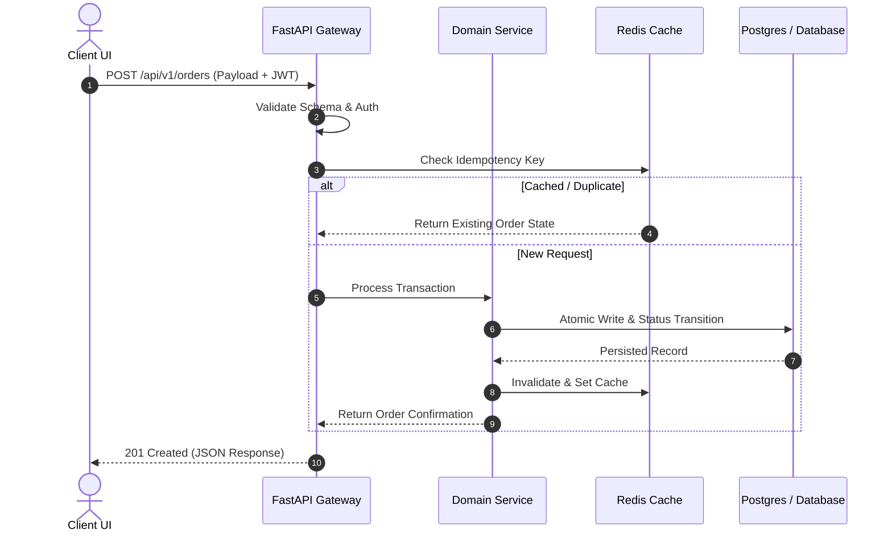

# Winning Application Backend & System Architecture

This skill provides the architectural blueprints, design patterns, and engineering standards for building high-speed, scalable, and fully mapped backend systems.

---

## 1. High-Speed API Development (FastAPI & Async Pipelines)

### Core Principles
- **Async Native Everywhere**:
  - Leverage `async`/`await` for all I/O-bound operations (database queries, network requests, cache lookups, disk reads).
  - Prevent blocking event loops by offloading heavy CPU computations to background worker pools (`asyncio.to_thread` or Celery/Redis Queue).
- **Type-Safe Contract Enforcement (Pydantic / Zod)**:
  - Every endpoint must strictly validate incoming request payloads and outgoing response schemas.
  - Return informative, standardized error responses with explicit HTTP status codes:
    ```json
    {
      "success": false,
      "error": {
        "code": "RESOURCE_NOT_FOUND",
        "message": "Service provider id 'pv_101' does not exist",
        "details": null
      }
    }
    ```
- **High-Throughput Streaming & Real-Time Endpoints**:
  - Use Server-Sent Events (SSE) or WebSockets (`fastapi.WebSocket`) for live progress updates, notification feeds, or streaming token responses.
  - Implement rate limiting (e.g., token bucket with Redis) and request timeout middleware to protect server health.

---

## 2. System Mapping & Data Flow Transparency

### End-to-End Mapping Protocol
- **Trace Every User Action**: Map the journey of every data packet through four unambiguous layers:
  1. **Presentation Layer (UI/Client)**: User action trigger, local optimistic state, payload formatting.
  2. **API & Routing Layer**: Gateway / FastAPI route, authorization/auth token verification, request validation.
  3. **Domain & Business Logic Layer**: Service handlers, pipeline orchestration, event publishing.
  4. **Persistence & Cache Layer**: Relational/NoSQL database queries, cache hits/misses, external cloud storage.

### Documentation Standards
- Every complex service must maintain a clear architecture diagram (Mermaid format):


---

## 3. Scalability Planning & Production Readiness

### Database Optimization & Indexing
- **Index High-Cardinality Filters**: Foreign keys, search queries, status enums, and timestamps used in `ORDER BY` must be indexed (`B-Tree` or compound indexes).
- **Connection Pooling**: Always configure client connection pools (`pool_size`, `max_overflow`, `pool_recycle`) to avoid database socket exhaustion under concurrent spikes.
- **Read-Write Separation & Caching Strategy**:
  - Cache static or slow-changing datasets (categories, service catalogs, provider profiles) with explicit TTLs.
  - Use cache invalidation on write (Write-Through or Cache-Aside).
- **Graceful Fault Tolerance**:
  - Implement retry mechanisms with exponential backoff and jitter for external network calls.
  - Implement circuit breakers for flaky downstream dependencies.
