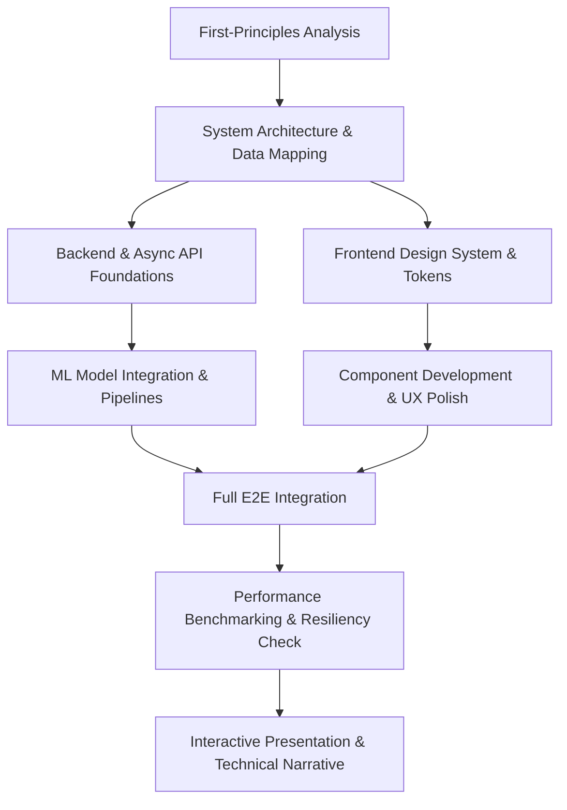

# Master Playbook: Building & Presenting Winning Applications

This master playbook unifies technical engineering, design excellence, and strategic presentation into an end-to-end operational standard.

---

## The Four Pillars at a Glance

| Pillar | Focus Areas | Key Disciplines |
| :--- | :--- | :--- |
| **1. Frontend & UX** | React, TypeScript, CSS Tokens, Micro-Interactions | Visual hierarchy, 3-second trust, zero dead ends, responsive polish |
| **2. Backend & Architecture** | FastAPI, Async Pipelines, Data Flow Mapping, Scalability | Low-latency routing, Pydantic type safety, caching, connection pooling |
| **3. Machine Learning & Processing** | PyTorch, ONNX, Real-Time Streams, Audio/Signal Processing | Startup model loading, non-blocking thread workers, WebSocket telemetry |
| **4. Presentation & Strategy** | First-Principles, Technical Storytelling, Interactive Decks | Problem deconstruction, judge-tailored narrative, disciplined time-boxing |

---

## Execution Workflow

### Step 1: First-Principles Framing
- Isolate the single most critical friction point.
- Write down the non-negotiable user journey and constraints before code generation.

### Step 2: System Mapping & Core Architecture
- Define schemas, contracts, and end-to-end data flow (UI -> API -> ML -> DB).
- Ensure async routing and database indices are established upfront.

### Step 3: Frontend & Visual Polish
- Establish typographic scales, colors, elevation shadows, and micro-interaction states.
- Eliminate broken states: provide rich empty states, skeleton loaders, and interactive previews.

### Step 4: ML & Real-Time Processing
- Pre-warm models in lifespan events; never load weights on request paths.
- Stream computationally heavy results over WebSockets or SSE with non-blocking executors.

### Step 5: High-Impact Delivery
- Frame the problem, breakthrough, and metric results into a crisp narrative.
- Deliver an interactive, responsive presentation that proves technical mastery.
