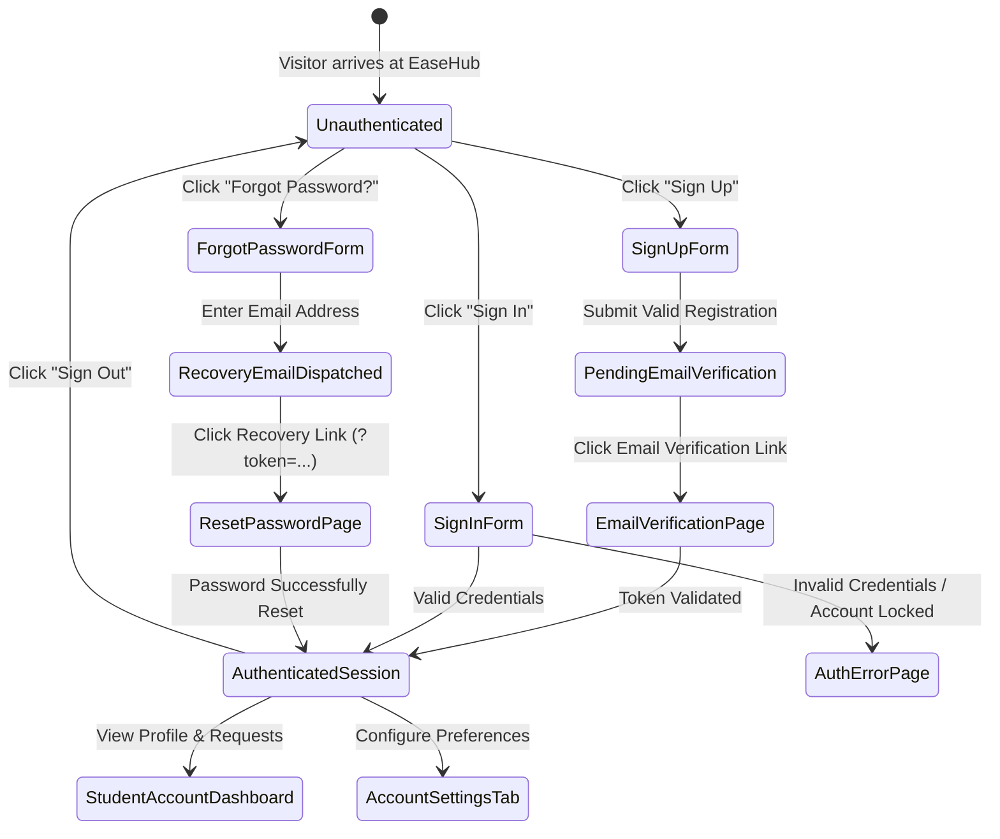
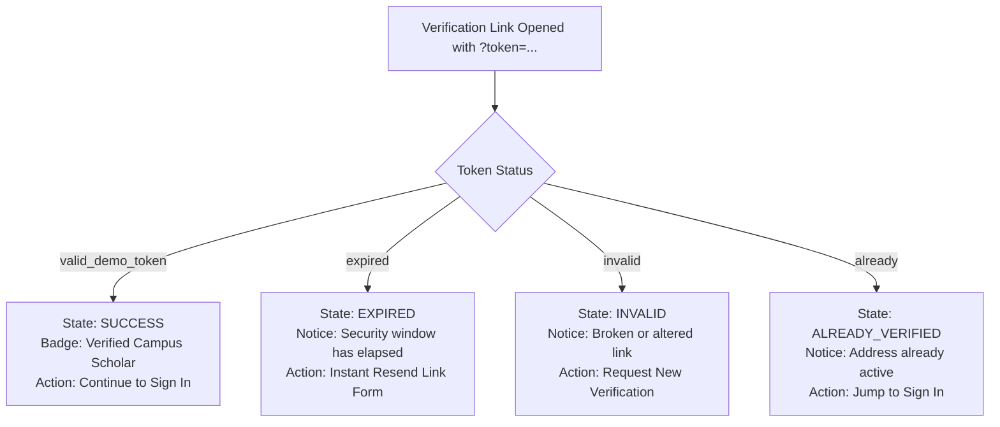
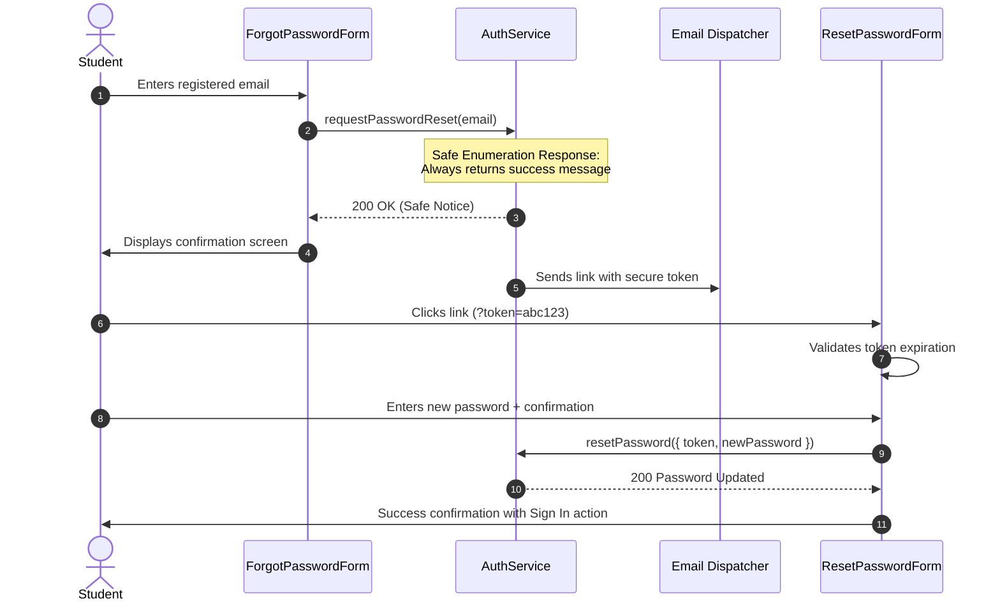

# EaseHub — Authentication Lifecycle & User Flows
**Phase 8: State Transition Specifications**  
**Document Version:** 1.0.0  
**Status:** Canonical Reference  

---

## 1. Complete Authentication Lifecycle State Diagram

---

## 2. Detailed User Flow Specifications

### 2.1 Sign Up Flow (`/auth/sign-up`)

1. **Step 1: Input Collection**
   - Student enters Full Name, Campus Email (institution-approved domain), Mobile Number, and Password.
2. **Step 2: Client-side Validation**
   - Real-time password strength meter validates complexity (minimum 8 characters, letters, numbers, symbols).
   - Format validation checks for valid email and 10-digit telephone.
3. **Step 3: Account Creation & Initial Session**
   - `AuthService.signUp()` registers account with `emailVerified: false`.
   - Returns mock verification instructions or triggers verification redirect.
   - If a safe `returnTo` URL was present, preserves it during handoff.

---

### 2.2 Email Verification Flow (`/auth/verify-email?token=...`)

The verification route handles 4 explicit validation states with real-time feedback:

#### Verification Sandbox Test Matrix:
- `?token=valid_demo_token`: Confirms address, displays student verification checkmark, triggers sign-in navigation.
- `?token=expired`: Notifies student that link is expired, reveals instant resend input with current email prefilled.
- `?token=invalid`: Renders alert explaining link was corrupted or tampered with.
- `?token=already`: Indicates account was previously confirmed and offers direct sign-in button.

---

### 2.3 Sign In Flow (`/auth/sign-in?returnTo=...`)

1. **Step 1: Credential Submission**
   - Student enters email/phone and password with accessible show/hide toggle.
2. **Step 2: Authentication Attempt**
   - `AuthService.signIn()` executes through active `IAuthProviderAdapter`.
3. **Step 3: Verification Check**
   - If account is flagged `account_locked`, routes to `/auth/error?error=account_locked`.
   - If credentials mismatch, displays inline error or routes to specialized error helper.
4. **Step 4: Safe Navigation Handoff**
   - Extracts `returnTo` parameter.
   - Passes parameter through `validateSafeReturnUrl()`.
   - For internal paths (e.g. `/services/laundry/book`), redirects directly to the booking checkout step without loss of context.
   - If invalid or absent, safely defaults to `#account`.

---

### 2.4 Password Recovery & Reset Lifecycle (`/auth/forgot-password` & `/auth/reset-password`)

---

### 2.5 Student Account & Preferences Management (`/account`)

The student account portal is segmented into 4 dedicated operational tabs:

1. **My Service Requests (`#account` or `#account/requests`)**:
   - Live tracking badges (`SUBMITTED`, `CONFIRMED`, `IN_PROGRESS`, `READY`, `COMPLETED`, `CANCELLED`).
   - Service item details, delivery date/time slot, campus provider name, and direct cancel/rebook actions.
2. **Profile & Campus Info (`#account/profile`)**:
   - Hostel block, room number, department, student ID, and emergency contact details.
3. **Security & Credentials (`#account/security`)**:
   - Password modification, active campus device sessions, two-factor authentication toggles.
4. **Settings & Preferences (`#account/settings`)**:
   - Instant SMS & WhatsApp delivery notices toggle.
   - Digital tax invoice & booking receipts toggle.
   - Hostel gate courier entry arrival notices toggle.
   - Room number masking for external delivery drivers toggle.
   - Hostel warden & caretaker access authorization toggle.
   - Peer campus delivery coordination discovery toggle.

---

### 2.6 Error Codes & Mapping (`/auth/error`)

| Error Code | Student Title | Contextual Action |
| :--- | :--- | :--- |
| `invalid_credentials` | Incorrect Credentials | Returns to Sign In form |
| `account_locked` | Account Temporarily Guarded | Routes to Forgot Password reset |
| `email_not_verified` | Email Verification Required | Triggers fresh verification link |
| `token_expired` | Security Token Expired | Opens resend token form |
| `token_invalid` | Invalid Security Token | Offers manual reset initiation |
| `rate_limited` | Too Many Attempts | Displays 60-second cooldown timer |
| `user_disabled` | Account Suspended | Displays Campus Support contact button |
